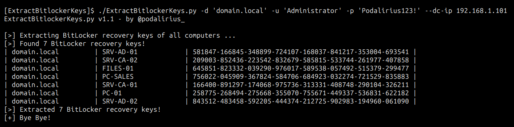
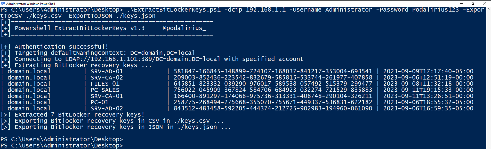

<p align="center">
    A post-exploitation python script to automatically extract the bitlocker recovery keys from a domain.
    <br>
    
    <a href="https://twitter.com/intent/follow?screen_name=podalirius_" title="Follow"></a>
    <a href="https://www.youtube.com/c/Podalirius_?sub_confirmation=1" title="Subscribe"></a>
    <br>
</p>

## Features

 - [x] Automatically gets the list of all computers from the domain controller's LDAP.
 - [x] Multithreaded connections to extract Bitlocker keys from LDAP.
 - [x] Export results in JSON with Computer FQDN, Domain, Recovery Key, Volume GUID, Created At and Organizational Units with `--export-json <file.json>`.
 - [x] Export results in XLSX with Computer FQDN, Domain, Recovery Key, Volume GUID, Created At and Organizational Units with `--export-xlsx <file.xlsx>`.
 - [x] Export results in SQLITE3 with Computer FQDN, Domain, Recovery Key, Volume GUID, Created At and Organizational Units with `--export-sqlite <file.db>`.
 - [x] Iterate on LDAP result pages to get every computer of the domain, no matter the size.

## Demonstration from Linux in Python

To extract Bitlocker recovery keys from all the computers of the domain `domain.local` you can use this command:

```
./ExtractBitlockerKeys.py -d 'domain.local' -u 'Administrator' -p 'Podalirius123!' --dc-ip 192.168.1.101
```

You will get the following output:



## Demonstration from Windows in Powershell

To extract Bitlocker recovery keys from all the computers of the domain `domain.local` you can use this command:

```
.\ExtractBitlockerKeys.ps1 -dcip 192.168.1.101 -Username 'Administrator' -Password 'Podalirius123!' -ExportToCSV ./keys.csv -ExportToJSON ./keys.json
```

You will get the following output:




## Usage

```
$ ./ExtractBitlockerKeys.py -h
ExtractBitlockerKeys.py v1.1 - by @podalirius_

usage: ExtractBitlockerKeys.py [-h] [-v] [-q] [-t THREADS] [--export-xlsx EXPORT_XLSX] [--export-json EXPORT_JSON] [--export-sqlite EXPORT_SQLITE] --dc-ip ip address [-d DOMAIN] [-u USER]
                               [--no-pass | -p PASSWORD | -H [LMHASH:]NTHASH | --aes-key hex key] [-k]

options:
  -h, --help            show this help message and exit
  -v, --verbose         Verbose mode. (default: False)
  -q, --quiet           Show no information at all.
  -t THREADS, --threads THREADS
                        Number of threads (default: 4).

Output files:
  --export-xlsx EXPORT_XLSX
                        Output XLSX file to store the results in.
  --export-json EXPORT_JSON
                        Output JSON file to store the results in.
  --export-sqlite EXPORT_SQLITE
                        Output SQLITE3 file to store the results in.

Authentication & connection:
  --dc-ip ip address    IP Address of the domain controller or KDC (Key Distribution Center) for Kerberos. If omitted it will use the domain part (FQDN) specified in the identity parameter
  -d DOMAIN, --domain DOMAIN
                        (FQDN) domain to authenticate to
  -u USER, --user USER  user to authenticate with

Credentials:
  --no-pass             Don't ask for password (useful for -k)
  -p PASSWORD, --password PASSWORD
                        Password to authenticate with
  -H [LMHASH:]NTHASH, --hashes [LMHASH:]NTHASH
                        NT/LM hashes, format is LMhash:NThash
  --aes-key hex key     AES key to use for Kerberos Authentication (128 or 256 bits)
  -k, --kerberos        Use Kerberos authentication. Grabs credentials from .ccache file (KRB5CCNAME) based on target parameters. If valid credentials cannot be found, it will use the ones specified in the command line.
```

## References

 - https://learn.microsoft.com/en-us/windows/win32/adschema/a-msfve-keypackage
 - https://learn.microsoft.com/en-us/windows/win32/adschema/a-msfve-recoveryguid
 - https://learn.microsoft.com/en-us/windows/win32/adschema/a-msfve-recoverypassword
 - https://learn.microsoft.com/en-us/windows/win32/adschema/a-msfve-volumeguid
